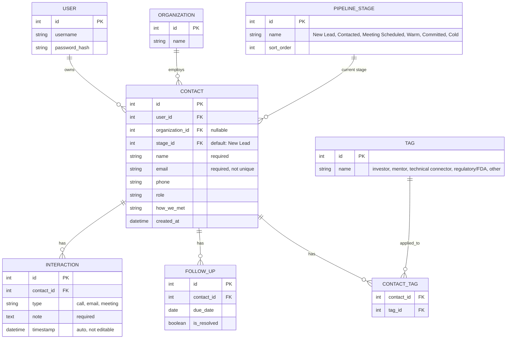

```mermaid
erDiagram
    USER ||--o{ CONTACT : owns
    ORGANIZATION ||--o{ CONTACT : employs
    PIPELINE_STAGE ||--o{ CONTACT : "current stage"
    CONTACT ||--o{ INTERACTION : has
    CONTACT ||--o{ FOLLOW_UP : has
    CONTACT ||--o{ CONTACT_TAG : has
    TAG ||--o{ CONTACT_TAG : applied_to

    USER {
        int id PK
        string username
        string password_hash
    }
    ORGANIZATION {
        int id PK
        string name
    }
    PIPELINE_STAGE {
        int id PK
        string name "New Lead, Contacted, Meeting Scheduled, Warm, Committed, Cold"
        int sort_order
    }
    CONTACT {
        int id PK
        int user_id FK
        int organization_id FK "nullable"
        int stage_id FK "default: New Lead"
        string name "required"
        string email "required, not unique"
        string phone
        string role
        string how_we_met
        datetime created_at
    }
    INTERACTION {
        int id PK
        int contact_id FK
        string type "call, email, meeting"
        text note "required"
        datetime timestamp "auto, not editable"
    }
    FOLLOW_UP {
        int id PK
        int contact_id FK
        date due_date
        boolean is_resolved
    }
    TAG {
        int id PK
        string name "investor, mentor, technical connector, regulatory/FDA, other"
    }
    CONTACT_TAG {
        int contact_id FK
        int tag_id FK
    }
```