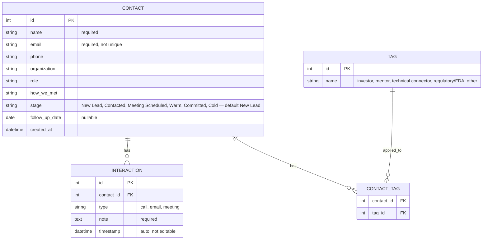

```mermaid
erDiagram
    CONTACT ||--o{ INTERACTION : has
    CONTACT ||--o{ CONTACT_TAG : has
    TAG ||--o{ CONTACT_TAG : applied_to

    CONTACT {
        int id PK
        string name "required"
        string email "required, not unique"
        string phone
        string organization
        string role
        string how_we_met
        string stage "New Lead, Contacted, Meeting Scheduled, Warm, Committed, Cold — default New Lead"
        date follow_up_date "nullable"
        datetime created_at
    }
    INTERACTION {
        int id PK
        int contact_id FK
        string type "call, email, meeting"
        text note "required"
        datetime timestamp "auto, not editable"
    }
    TAG {
        int id PK
        string name "investor, mentor, technical connector, regulatory/FDA, other"
    }
    CONTACT_TAG {
        int contact_id FK
        int tag_id FK
    }
```